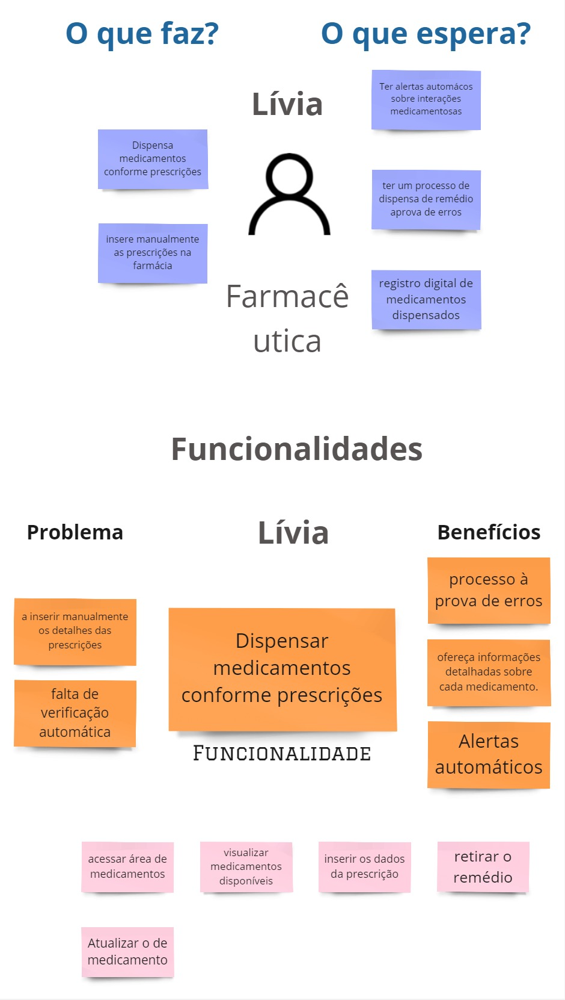
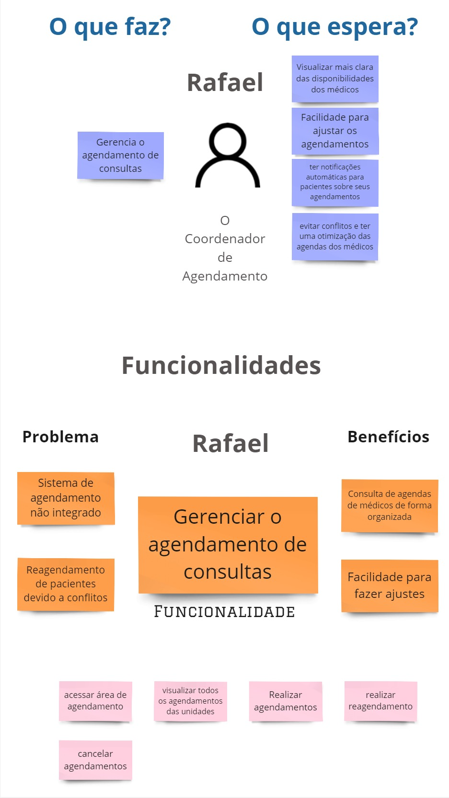
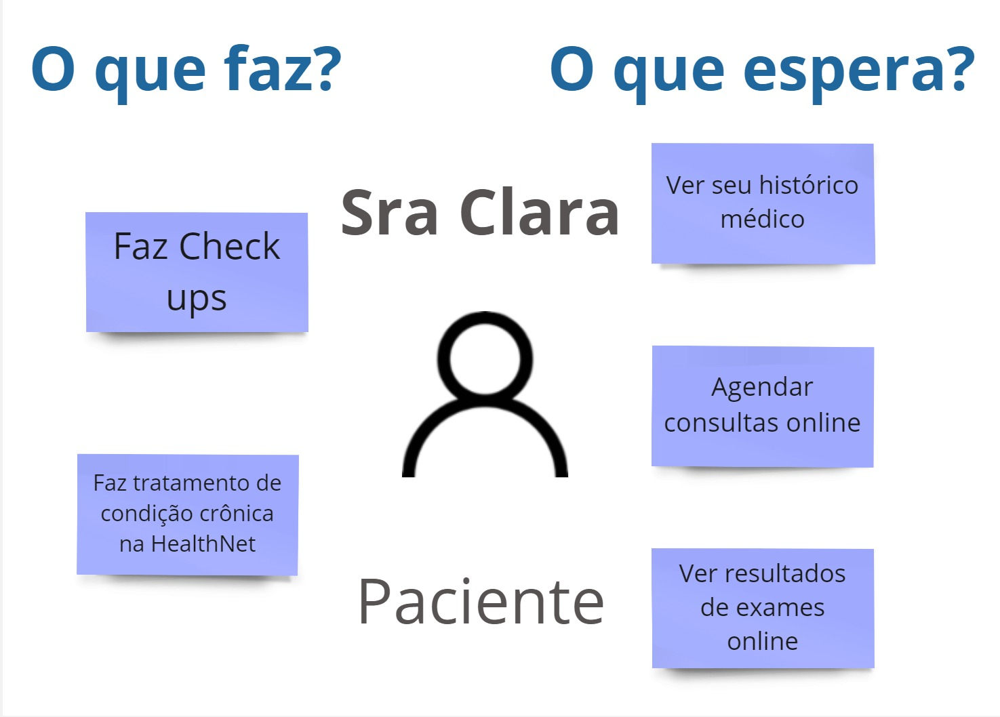

# Atividade do Product Backlog Building (PBB)
 O PBB é um método de gestão de projetos, com foco no produto, mostrando uma espécie de mapeamento das funcionalidades de cada persona, atreladas aos seus respectivos problemas. Apresentaremos o PBB para o desenvolvimento do software "HealthNet System".

### Problemas e Expectativas

Aqui temos quais são os problemas atuais que a clínica está enfrentando, e quais são as expectativas, o que querem alcançar com o produto de software

### personas
Aqui temos todas as personas que foram identificadas, cada um delas será mais detalhada a seguir.
.jpg>)

### Funcionalidades e PBI's
Aqui temos o que a persona faz, o que ela espera fazer, as suas funcionalides de acordo com os itens anteriores e os seus PBI's, devidamente priorizados (a forma de priorização será apresentada mais à frente).

### Recepcionista

### Médico Clínico Geral

### Farmacêutica

### O Coordenador de Agendamento

### Paciente

## Critérios de Priorização
Aqui temos quais foram os critérios utilizados para realizar a priorização dos PBI's, juntamente com seus respectivos scores.

| **Priorização**                                            | **Frequência de Uso** | **Valor de Negócio** | **Total** |
|------------------------------------------------------------|-----------------------|----------------------|-----------|
| Atualizar Informações de pacientes                         | 5                     | 3                    | 8         |
| Realizar o registro de novos pacientes                     | 3                     | 3                    | 6         |
| Realizar a transferência de pacientes                      | 2                     | 2                    | 4         |
| Realizar o encaminhamento de pacientes                     | 5                     | 3                    | 8         |
| Acessar o histórico de pacientes                           | 5                     | 3                    | 8         |
| Inserir notas e prescrições nos históricos de pacientes    | 5                     | 3                    | 8         |
| Receber alertas sobre interações medicamentosas            | 5                     | 3                    | 8         |
| Realizar o acesso a prescrições de pacientes               | 4                     | 3                    | 7         |
| Visualizar a disponibilidade dos médicos                   | 5                     | 3                    | 8         |
| Visualizar o resultado de exames                           | 3                     | 3                    | 6         |
| Realizar agendamentos de consultas                         | 5                     | 2                    | 7         |
| Realizar a visualização de consultas                       | 2                     | 2                    | 4         |
| Realizar o registro de medicamentos dispensados            | 5                     | 3                    | 8         |
| Realizar ajustes em agendamentos de pacientes              | 4                     | 2                    | 6         |
| Enviar notificações automáticas sobre agendamentos         | 5                     | 1                    | 6         |
| Realizar o acesso dos dados médicos                        | 3                     | 3                    | 6         |
| Receber lembretes sobre medicamentos                       | 4                     | 1                    | 5         |
| Gerar relatórios de monitoramento                          | 4                     | 3                    | 7         |
| Fazer atualizações e melhorias                             | 2                     | 3                    | 5         |
| Fornecer suporte técnico a todos                           | 4                     | 3                    | 7         |

# Atividade do Behavior Driven Development (BDD)

Agora, para o BDD, do mesmo sistema a cima, foi preciso primeiramente criar as US's, e o próprio formato do PBB auxilia nisso, e depois seus critérios de aceitação

### 1. Definição de Personas
Nome: Identificação do usuário ou persona.
Papel: Descrição do papel que a persona desempenha no sistema.
### 2. Descrição da Funcionalidade
Problema: Descrição clara do problema que a funcionalidade busca resolver.
Benefícios: Benefícios esperados com a implementação da solução.
### 3. Justificativa do Benefício
PBI (Product Backlog Item): Descrição detalhada do item no backlog do produto.
### 4. Formato de Escrita de História de Usuário
Estrutura:

Como <papel/perfil>: Identifica o papel ou perfil do usuário.
Posso <ação/meta>: Descreve a ação ou meta que o usuário deseja alcançar.
Para <benefício/razão>: Explica o benefício ou a razão para alcançar essa meta.
3 W's:

Quem?: Quem é o usuário ou persona?
O que?: O que o usuário deseja fazer?
Por quê?: Por que essa ação é importante?
Critérios de Aceite:

Critério de Aceitação 01: Primeira condição para considerar a história como completa.
Critério de Aceitação 02: Segunda condição para considerar a história como completa.
Critério de Aceitação 03: Terceira condição para considerar a história como completa.
3 C's:

Cartão: Representa o item de trabalho no backlog.
Conversa: Comunicação e esclarecimentos entre as partes interessadas.
Confirmação: Validação de que os critérios de aceite foram atendidos.
### 5. Formato de Escrita de Cenários BDD
Cenário: <título>
Dado que <contexto inicial>: Situação inicial ou pré-condição.
Quando <evento ou ação>: Ação ou evento que dispara o comportamento.
Então <resultado esperado>: Resultado esperado ou comportamento observado após a ação.
### 6. Princípios INVEST
O acrônimo INVEST ajuda a garantir que as histórias de usuário sejam bem definidas e eficazes:

Independent (Independente): A história deve ser independente de outras.

Negotiable (Negociável): A história deve ser aberta a discussões e revisões.

Valuable (Valioso): A história deve trazer valor ao usuário ou ao negócio.

Estimable (Estimável): A história deve ser possível de ser estimada em termos de esforço.

Small (Pequeno): A história deve ser pequena o suficiente para ser concluída em um curto período.

Testable (Testável): Deve ser possível testar a história para garantir que os critérios de aceite foram atendidos.

#### Uma vez tendo as US's e seus critérios de aceitação, fizemos os BDD's.

## Canvas PBB
**Link1**
https://miro.com/app/board/uXjVKh_XWTQ=/

**Link2**
https://miro.com/welcomeonboard/eDlONnJaVFhYYkpRMkd2RkNUNmZaY3A4RjZzNlA1Q2kxbm1WalBqdlB4VU1waVlEWldHbGlxcm1XMU5NUWNXZXwzNDU4NzY0NTgzMzI1MTU5ODM5fDI=?share_link_id=337025073247

<iframe width="560" height="315" src="https://miro.com/app/board/uXjVKh_XWTQ=/" title="Miro" frameborder="0" allow="accelerometer; autoplay; clipboard-write; encrypted-media; gyroscope; picture-in-picture; web-share" referrerpolicy="strict-origin-when-cross-origin" allowfullscreen></iframe>

## **Video Missão 3**
<iframe width="560" height="315" src="https://www.youtube.com/embed/nrPPc0Tnj3A?si=Thddag0B_WUxJDSy" title="YouTube video player" frameborder="0" allow="accelerometer; autoplay; clipboard-write; encrypted-media; gyroscope; picture-in-picture; web-share" referrerpolicy="strict-origin-when-cross-origin" allowfullscreen></iframe>

## Histórico de versão

 Data       | Versão | Descrição                        | Autor          |
| ---------- | ------ | -------------------------------- | -------------- |
| 22/08/2024 | 1.0    | Realização da atividade e criação do documento |Igor Justino |
| 23/08/2024 | 1.1    | Revisão da documentação | Igor Justino |
| 23/08/2024 | 1.2    | Revisão da documentação | André João |
| 07/08/2024 | 1.3    | Correção da atividade | Igor Justino |
