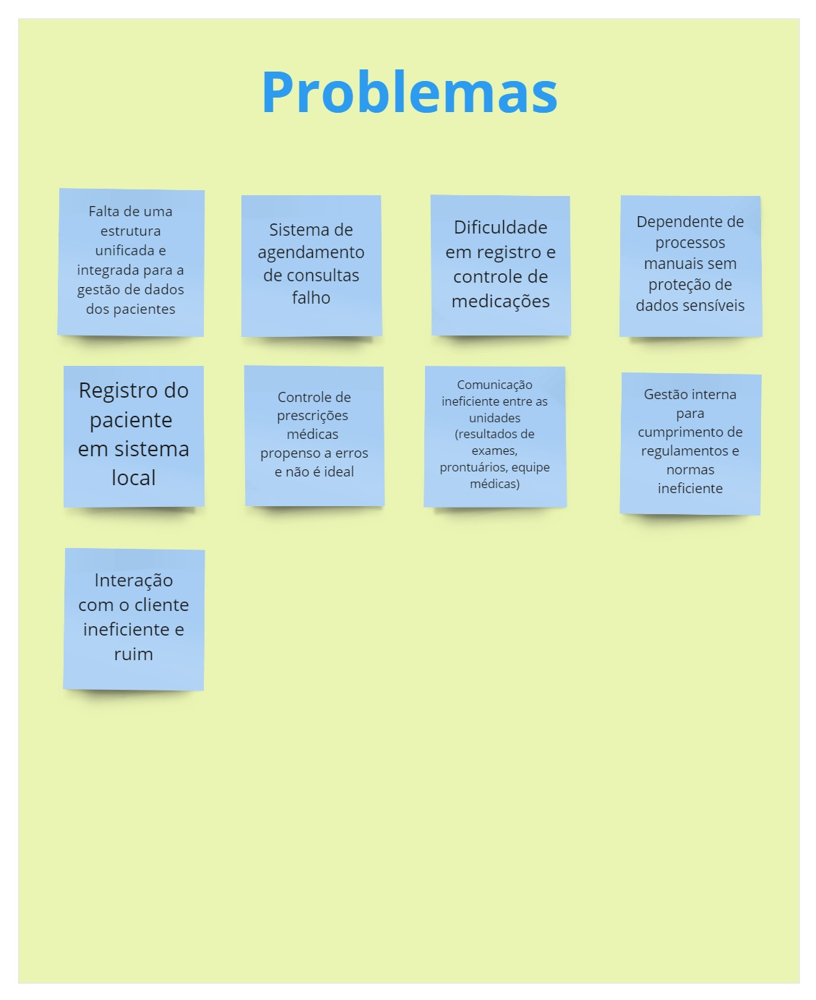
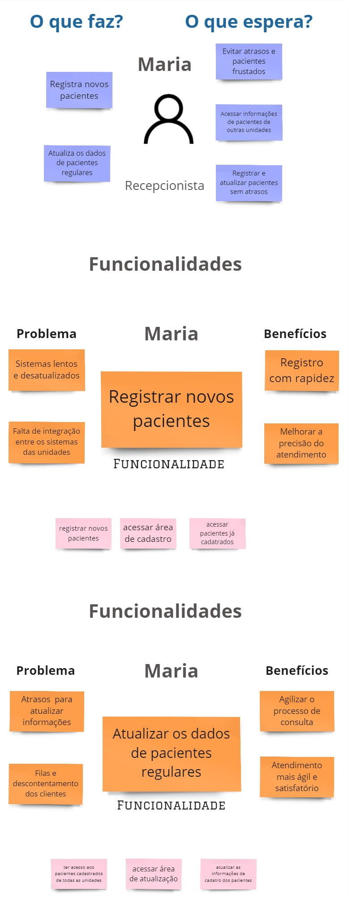
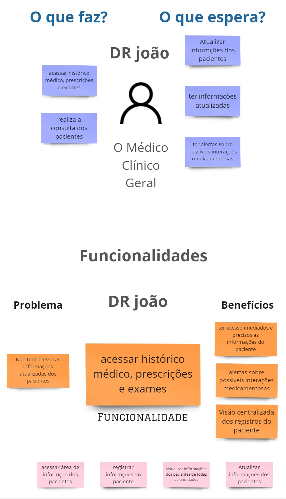

# Atividade do Product Backlog Building (PBB)

O PBB é um método de gestão de projetos, com foco no produto, mostrando uma espécie de mapeamento das funcionalidades de cada persona, atreladas aos seus respectivos problemas. Apresentaremos o PBB para o desenvolvimento do software "Calorie Counter".

                            Figura 1:

# Estrutura geral do PBB

Aqui o objetivo é conseguirmos ver que a organização foi devidamente seguida. A seguir detalharemos cada uma das partes do PBB.
aqui temo o detalhamento das personas referente ao projeto. Esclarecendo os problemas enfrentados pelo Nutricionista e as expectativas do Paciente. Essas personas são essenciais para entender as necessidades e as expectativas dos usuários principais do sistema, e, assim, direcionar o desenvolvimento do produto. 
Essas personas ajudam a definir as prioridades para o desenvolvimento do sistema "Calorie Explorer". Para o Nutricionista, o foco deve estar em melhorar a eficiência operacional e a comunicação, além de atualizar e modernizar os sistemas. Para o Paciente, o sistema deve ser seguro, fácil de usar, com acesso rápido aos históricos e comunicação otimizada com o nutricionista. Essas considerações são fundamentais para a criação de um produto que atenda às necessidades de seus principais usuários.

Essa atividade ilustrada por dois diagramas ajuda a identificar as funcionalidades que são mais importantes para o desenvolvimento do produto, baseando-se nas necessidades e expectativas tanto dos usuários (pacientes) quanto dos stakeholders (nutricionistas). O resultado final será um backlog priorizado que guiará o desenvolvimento do produto.

                          Figura 2:

                          Figura 3:

# Atividade do do Product Backlog Item(PBI)

  Aqui temos  o diagrama que organiza os Itens do Backlog do Produto (Product Backlog Items - PBIs) para dois papéis diferentes em um sistema: Nutricionista e Paciente. Cada papel tem uma lista de atividades ou funcionalidades que precisam ser desenvolvidas, detalhadas como PBIs.

## Histórico de versão

 Data       | Versão | Descrição                        | Autor          |
| ---------- | ------ | -------------------------------- | -------------- |
| 19/08/2024 | 1.0    | Inclusão do PBB e PBI | André João C Gomes, Igor de Sousa |