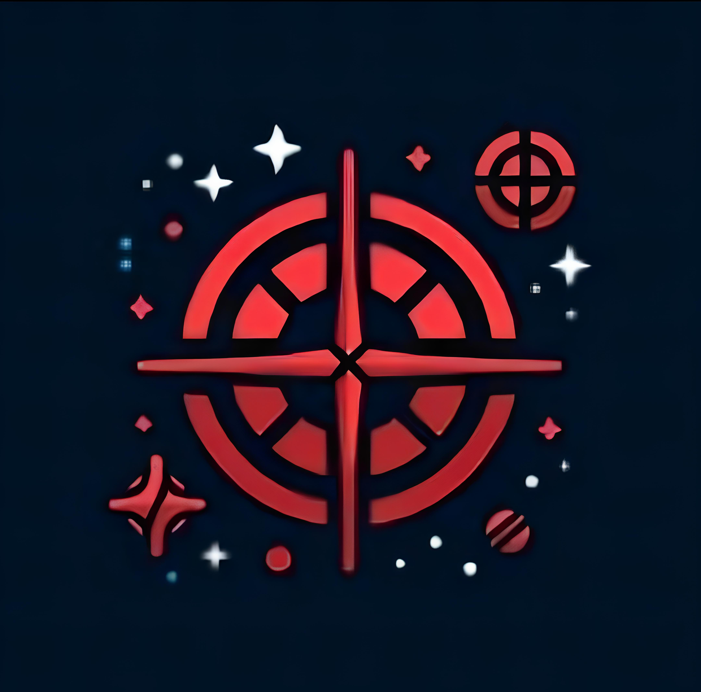

# Relic Founders

## Brasão da Facção

## Personagens

* **Cat:** | 20 anos | Planeta Astradon | Raça: Auris Purpurus | 
**História:** Nativa do planeta Astradon, Cat tinha uma irmã mais velha que lutava na guerra como exploradora, sendo sempre uma inspiração para ela. Em uma de suas missões, a irmã se tornou um anjo e transmitiu-lhe uma missão: assumir o posto de exploradora e buscar o fragmento prismático milenar para o comando estelar em um planeta abandonado. Durante essa missão, ela foi capturada pela Celestia e levada à prisão.

* **Muadib:** | 33 anos | Planeta Karisar | Raça: Menfer | **História:** Muadib é Nativo de um planeta desértico chamado Karisar que tem uma especiaria muito desejada por seu valor. Certo dia um grupo de exploradores chegam ao seu planeta com intuito de aprender sobre seu povo e ele conhece uma Auris Purpurus que o inspira a explorar outros lugares. Tempo depois, tropas de Celestia invadem Karisar para roubar a especiaria e ele luta com seu povo para proteger seu planeta. Com isso acaba sendo capturado e preso.

* **Fastus Black:** | 20 anos | Planeta Exegoll  | Raça: Triférico | 
**História:** Nativo de um planeta super tecnológico e mágico chamado Exegoll, desde cedo Fastus sempre foi ensinado pela sua mãe a ter curiosidade e vontade de conhecer o desconhecido. a  mãe de fastus era uma exploradora e trabalhava para o Comando Estelar, versada na arte da junção entre magia e tecnologia. Desde cedo, ela o incentivava a estudar e treinar para seguir o mesmo caminho que ela, um caminho que sempre o fascinou. Em uma certa missão, sua mãe passou anos desaparecida com o grupo de exploradores do qual ela era líder. Foi aí então que a jornada dele começou, em busca de pistas de onde sua mãe poderia estar, em conjunto com suas próprias aventuras em busca de tumbas e todo tipo de quinquilharia antiga que pudesse ajudá-lo nessa jornada. Sempre lutando e correndo dos Conglomerados, estava tudo dando certo até ele se deparar com a Celestia e eles o levarem preso.

* **Flide (Neon Shadow):** | 22 anos | Planeta neo-nexia  | Raça: Cyber-Humano | 
**História:** Flide é uma menina destemida em um mundo cyberpunk do planeta de Neo-Nexia. Inconformada com a injustiça e determinada a explorar além dos limites impostos pela sociedade tecnológica, ela se torna conhecida como Neon Shadow. Utilizando suas habilidades de combate e hacking, ela desafia as corporações corruptas e inspira outros a se levantarem contra a opressão. Sua jornada é marcada pela busca incessante por verdade e liberdade, enquanto ela navega pelas sombras da cidade, sempre explorando novos horizontes e desafiando as expectativas. Flide descobre os sinistros planos de Slitherium, um conglomerado que invade planetas com grupos de caçadores de recompensas para explorar minérios, eliminar opositores e até caçar espécies ameaçadas. Após hackear suas operações, ela se torna alvo da corporação, sendo capturada e feita refém.

* **Dr. Rorschach:** | 32 anos | Planeta Neo-Nexia | Raça: Cyber-Humano | 
**História:** Será nativo da Neo-Nexia, no auge da tecnologia humana, após sofrer um grave acidente, implantou vários aparatos tecnológicos em seu corpo, possuindo várias capacidades acima de um humano normal, e dono de uma inteligência inigualável.
Trabalhava no conglomerado Celestia, esse conglomerado estava trabalhando secretamente em pesquisas biológicas dentro dos planos de criar uma raça de supersoldados genéticamente modificados, para isso eram escolhidas cobaias que eram tratadas da forma mais desumana possível. Revoltado com isso, abandonou o projeto, mas como seus conhecimentos representavam um perigo caso fosse vazado, foi acusado de traição contra a  galáxia e foi preso juntamente com vários outros pesquisadores, inclusive uma jovem hacker extremamente talentosa...

* **Whutus:** | 110 anos | Planeta Arghor | Raça: Meio Orc Meio Demônio | 
**História:** Ele era de um planeta chamado Arghor, dividido em duas facções imersas numa guerra interminável ao longo de gerações. Ele batalhou por diversas décadas, e sua facção finalmente estava próxima de alcançar a vitória almejada. Contudo, um dia, a tecnologia de seus inimigos mudou drasticamente. Surgiram armas e armaduras das quais ele nunca tinha visto antes. Os espiões relataram que seus adversários estavam recebendo apoio de um grupo militar altamente tecnológico e perigoso: a Celestia.
Com essa reviravolta, a facção rival conseguiu mudar o curso da guerra. Sua facção, privada de qualquer apoio externo após a entrada da Celestia, começou a perder terreno rapidamente. Após uma década de conflito, sua facção estava destroçada, seu rei morto, e ele era um dos poucos sobreviventes do massacre. Mesmo diante da tragédia, quando lhe deram a escolha entre virar escravo ou enfrentar a prisão perpétua, ele escolheu esta última, mantendo sua lealdade ao rei falecido inquebrantável. Como um guerreiro forte, com sangue de demônio e de Orc, ele, Whutus, possuía uma força, inteligência e resistência acima do comum, o que o levou a ser posto numa prisão de segurança máxima. Lá, seus membros foram presos com metais ultra resistentes, impossibilitando qualquer movimento ou ação além de receber comida e se alimentar.
Após muitos anos na prisão, os carcereiros achavam que ele havia enfraquecido, mas seu espírito permanecia inquebrável. Ao longo dos anos, ele conseguiu enfraquecer uma parte do metal de sua prisão, aproveitando-se da negligência dos guardas que raramente inspecionavam sua cela. Após uma década, ele finalmente quebrou a armadura que o aprisionava e fugiu, eliminando os guardas que cruzaram seu caminho.

* **Durin:** | ??? anos | Planeta Khuzdul | Raça: Anão | **História:** Durin nasceu em uma colônia anã próspera em minerais no planeta  Khuzdul, onde o talento para a mecânica corria em suas veias desde a infância. Sua engenhosidade o levou a se tornar um mestre da engenharia mecânica, e com uma habilidade notável em robótica Durin tem um interesse particular em explorar asteroides, ele possui uma oficina espacial como base para lançar expedições para asteroides próximos.  Ele lidera equipes de robôs e drones em missões para mapear, analisar e extrair recursos valiosos. Durin acredita firmemente na superioridade da tecnologia anã e na engenhosidade de seu povo.

## Os membros se encontram e a Facção é criada 

Presos pela Celestia e mandados para uma prisão no planeta Callisto, Cat, Muadib, Fastus, Flide e Dr. Rorschach acabaram indo para o mesmo bloco de celas, a ala A. Flide reconheceu o Dr. Rorschach dos arquivos hackeados e se irritou com sua presença. O doutor explicou o que realmente aconteceu e juntos, usando suas habilidades, começaram a pensar em formas de abrir as celas. Durante o planejamento, os outros prisioneiros que estavam na ala escutaram seus planos e decidiram ajudar, cada um exercendo uma função baseada nos conhecimentos que tinham. Com o plano finalizado, os prisioneiros precisavam de uma distração para iniciarem sua execução. Coincidentemente, Whutus, um antigo prisioneiro da ala X conseguiu se soltar e matou um dos guardas que vagava pelo setor, causando uma grande euforia na prisão. Alarmes foram acionados e centenas de guardas corriam desesperadamente por todos os lados, esse era o momento perfeito para os prisioneiros da ala A colocarem o plano em ação.
As celas foram hackeadas e os cinco prisioneiros lutaram contra os guardas pelos corredores em busca do hangar das aeronaves, uma vez que o mapa da prisão também havia sido hackeado.
Os embates estavam cada vez mais duros até que Whutus surgiu e ajudou os fugitivos da ala A a exterminarem diversos guardas da Celestia.

Todos fugiram juntos em uma pequena nave. Porém, ela acabou sendo danificada no processo da fuga e acabaram vagando pelo universo infinito por muito tempo, até que a nave colidiu com um asteroide. Por sorte, era a base asteroide de Durin, que os abrigou por um tempo até pensarem no que poderia ser feito depois daquela fuga. Após passarem um tempo na base asteroide de Durin se conhecendo melhor e entendendo a motivação de cada um ali presente, Cat contou toda sua história, envolvendo sua irmã e a missão por ela deixada. Então, sugeriu que fossem atrás do Comando Estelar para se aliarem a eles e combaterem os Conglomerados, já que todos no asteroide haviam tido problemas com eles e não seria nada mal ajudar a libertar Calamum Caeruleum das forças hostis. Muadib se lembrou de sua antiga paixão, que fazia parte do Comando Estelar e de todo mal que os conglomerados fizeram com seu planeta. Fastus ficou empolgado com a ideia, pois lembrara de sua mãe, que foi líder de um grupo de exploradores e poderia achar mais pistas sobre o desaparecimento dela. O Dr. Rorschach estava disposto a integrar o Comando Estelar para ter sua redenção dos tempos trabalhando para a Celestia. Flide já era uma ativista contra o sistema dos conglomerados, então nem pensou duas vezes. Whutus não tinha para onde voltar, já que seu rei fora morto e sua facção destroçada, portanto ele achou interessante a proposta de exterminar os inimigos que destruiram seus companheiros e o deixaram preso por anos, enquanto Durin imaginou em como seria interessante ajudar o grupo com suas invenções revolucionárias.

Todos tinham motivos para ingressar no Comando Estelar e firmaram um pacto de fazer de tudo para vencer essa guerra. Durin, com seus conhecimentos em engenharia, arrumou a nave e partiram em direção ao Comando Estelar. Foi assim que aconteceu, dessa maneira, que nasceu os Relic Founders.

|Data|Versão|Descrição|Autor|
|------------|--------|------------------------------|---------------|
|17/04/2024|1.0|Inclusão da História no GitPages|Nicolas Bomfim|