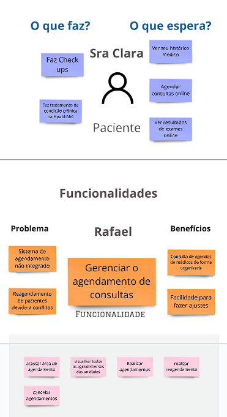

## O PBB é um método de gestão de projetos, com foco no produto, mostrando uma espécie de mapeamento das funcionalidades de cada persona, atreladas aos seus respectivos problemas. Apresentaremos o PBB para o desenvolvimento do software "HealthNet System".

### Problemas e Expectativas

Aqui temos quais são os problemas atuais que a clínica está enfrentando, e quais são as expectativas, o que querem alcançar com o produto de software

### personas
Aqui temos todas as personas que foram identificadas, cada um delas será mais detalhada a seguir.
.jpg>)

### Funcionalidades e PBI's
Aqui temos o que a persona faz, o que ela espera fazer, as suas funcionalides de acordo com os itens anteriores e os seus PBI's, devidamente priorizados (a forma de priorização será apresentada mais à frente).

### Recepcionista

### Médico Clínico Geral

### Farmacêutica

### O Coordenador de Agendamento

### Paciente

## Critérios de Priorização
Aqui temos quais foram os critérios utilizados para realizar a priorização dos PBI's, juntamente com seus respectivos scores.

| **Priorização**                                            | **Frequência de Uso** | **Valor de Negócio** | **Total** |
|------------------------------------------------------------|-----------------------|----------------------|-----------|
| Atualizar Informações de pacientes                         | 5                     | 3                    | 8         |
| Realizar o registro de novos pacientes                     | 3                     | 3                    | 6         |
| Realizar a transferência de pacientes                      | 2                     | 2                    | 4         |
| Realizar o encaminhamento de pacientes                     | 5                     | 3                    | 8         |
| Acessar o histórico de pacientes                           | 5                     | 3                    | 8         |
| Inserir notas e prescrições nos históricos de pacientes    | 5                     | 3                    | 8         |
| Receber alertas sobre interações medicamentosas            | 5                     | 3                    | 8         |
| Realizar o acesso a prescrições de pacientes               | 4                     | 3                    | 7         |
| Visualizar a disponibilidade dos médicos                   | 5                     | 3                    | 8         |
| Visualizar o resultado de exames                           | 3                     | 3                    | 6         |
| Realizar agendamentos de consultas                         | 5                     | 2                    | 7         |
| Realizar a visualização de consultas                       | 2                     | 2                    | 4         |
| Realizar o registro de medicamentos dispensados            | 5                     | 3                    | 8         |
| Realizar ajustes em agendamentos de pacientes              | 4                     | 2                    | 6         |
| Enviar notificações automáticas sobre agendamentos         | 5                     | 1                    | 6         |
| Realizar o acesso dos dados médicos                        | 3                     | 3                    | 6         |
| Receber lembretes sobre medicamentos                       | 4                     | 1                    | 5         |
| Gerar relatórios de monitoramento                          | 4                     | 3                    | 7         |
| Fazer atualizações e melhorias                             | 2                     | 3                    | 5         |
| Fornecer suporte técnico a todos                           | 4                     | 3                    | 7         |
