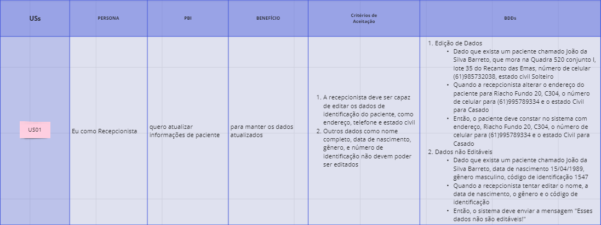

# Atividade do Product Backlog Building (PBB)
 O PBB é um método de gestão de projetos, com foco no produto, mostrando uma espécie de mapeamento das funcionalidades de cada persona, atreladas aos seus respectivos problemas. Apresentaremos o PBB para o desenvolvimento do software "HealthNet System".

### Problemas e Expectativas

Aqui temos quais são os problemas atuais que a clínica está enfrentando, e quais são as expectativas, o que querem alcançar com o produto de software

### personas
Aqui temos todas as personas que foram identificadas, cada um delas será mais detalhada a seguir.
.jpg>)

### Funcionalidades e PBI's
Aqui temos o que a persona faz, o que ela espera fazer, as suas funcionalides de acordo com os itens anteriores e os seus PBI's, devidamente priorizados (a forma de priorização será apresentada mais à frente).

### Recepcionista

### Médico Clínico Geral

### Farmacêutica

### O Coordenador de Agendamento

### Paciente

## Critérios de Priorização
Aqui temos quais foram os critérios utilizados para realizar a priorização dos PBI's, juntamente com seus respectivos scores.

| **Priorização**                                            | **Frequência de Uso** | **Valor de Negócio** | **Total** |
|------------------------------------------------------------|-----------------------|----------------------|-----------|
| Atualizar Informações de pacientes                         | 5                     | 3                    | 8         |
| Realizar o registro de novos pacientes                     | 3                     | 3                    | 6         |
| Realizar a transferência de pacientes                      | 2                     | 2                    | 4         |
| Realizar o encaminhamento de pacientes                     | 5                     | 3                    | 8         |
| Acessar o histórico de pacientes                           | 5                     | 3                    | 8         |
| Inserir notas e prescrições nos históricos de pacientes    | 5                     | 3                    | 8         |
| Receber alertas sobre interações medicamentosas            | 5                     | 3                    | 8         |
| Realizar o acesso a prescrições de pacientes               | 4                     | 3                    | 7         |
| Visualizar a disponibilidade dos médicos                   | 5                     | 3                    | 8         |
| Visualizar o resultado de exames                           | 3                     | 3                    | 6         |
| Realizar agendamentos de consultas                         | 5                     | 2                    | 7         |
| Realizar a visualização de consultas                       | 2                     | 2                    | 4         |
| Realizar o registro de medicamentos dispensados            | 5                     | 3                    | 8         |
| Realizar ajustes em agendamentos de pacientes              | 4                     | 2                    | 6         |
| Enviar notificações automáticas sobre agendamentos         | 5                     | 1                    | 6         |
| Realizar o acesso dos dados médicos                        | 3                     | 3                    | 6         |
| Receber lembretes sobre medicamentos                       | 4                     | 1                    | 5         |
| Gerar relatórios de monitoramento                          | 4                     | 3                    | 7         |
| Fazer atualizações e melhorias                             | 2                     | 3                    | 5         |
| Fornecer suporte técnico a todos                           | 4                     | 3                    | 7         |

# Atividade do Behavior Driven Development (BDD)

Agora, para o BDD, do mesmo sistema a cima, foi preciso primeiramente criar as US's, e o próprio formato do PBB auxilia nisso, e depois seus critérios de aceitação

### 1. Definição de Personas
Nome: Identificação do usuário ou persona.
Papel: Descrição do papel que a persona desempenha no sistema.
### 2. Descrição da Funcionalidade
Problema: Descrição clara do problema que a funcionalidade busca resolver.
Benefícios: Benefícios esperados com a implementação da solução.
### 3. Justificativa do Benefício
PBI (Product Backlog Item): Descrição detalhada do item no backlog do produto.
### 4. Formato de Escrita de História de Usuário
Estrutura:

Como <papel/perfil>: Identifica o papel ou perfil do usuário.
Posso <ação/meta>: Descreve a ação ou meta que o usuário deseja alcançar.
Para <benefício/razão>: Explica o benefício ou a razão para alcançar essa meta.
3 W's:

Quem?: Quem é o usuário ou persona?
O que?: O que o usuário deseja fazer?
Por quê?: Por que essa ação é importante?
Critérios de Aceite:

Critério de Aceitação 01: Primeira condição para considerar a história como completa.
Critério de Aceitação 02: Segunda condição para considerar a história como completa.
Critério de Aceitação 03: Terceira condição para considerar a história como completa.
3 C's:

Cartão: Representa o item de trabalho no backlog.
Conversa: Comunicação e esclarecimentos entre as partes interessadas.
Confirmação: Validação de que os critérios de aceite foram atendidos.
### 5. Formato de Escrita de Cenários BDD
Cenário: <título>
Dado que <contexto inicial>: Situação inicial ou pré-condição.
Quando <evento ou ação>: Ação ou evento que dispara o comportamento.
Então <resultado esperado>: Resultado esperado ou comportamento observado após a ação.
### 6. Princípios INVEST
O acrônimo INVEST ajuda a garantir que as histórias de usuário sejam bem definidas e eficazes:

    Independent (Independente): A história deve ser independente de outras.
    Negotiable (Negociável): A história deve ser aberta a discussões e revisões.
    Valuable (Valioso): A história deve trazer valor ao usuário ou ao negócio.
    Estimable (Estimável): A história deve ser possível de ser estimada em termos de esforço.
    Small (Pequeno): A história deve ser pequena o suficiente para ser concluída em um curto período.
    Testable (Testável): Deve ser possível testar a história para garantir que os critérios de aceite foram atendidos.

#### Uma vez tendo as US's e seus critérios de aceitação, fizemos os BDD's.

| **US** | **Persona** | **PBI** | **Critérios de Aceitação** | **BDD** |
|--------|-------------|---------|----------------------------|---------|
| **US01** | Maria (Recepcionista) | Registrar novos pacientes | 1. Maria deve ser capaz de registrar novos pacientes sem atrasos. 2. O sistema deve garantir que todos os campos obrigatórios estão preenchidos antes de permitir o registro. | **Registro de Paciente** **Cenário:** Registro bem-sucedido de paciente. **Dado que** Maria acessa a tela de registro de pacientes, **Quando** ela insere todos os dados obrigatórios e clica em "Registrar", **Então** o sistema salva o novo paciente com sucesso. |
| **US02** | Dr. João (Médico Clínico Geral) | Atualizar informações dos pacientes regulares | 1. O Dr. João deve poder atualizar informações de pacientes existentes. 2. O sistema deve impedir a edição de dados não permitidos como nome e data de nascimento. | **Atualização de Dados** **Cenário:** Atualização de dados do paciente. **Dado que** Dr. João acessa o histórico do paciente, **Quando** ele tenta alterar o endereço e telefone do paciente, **Então** o sistema salva as novas informações sem permitir a edição de dados restritos. |
| **US03** | Lívia (Farmacêutica) | Dispensar medicamentos conforme prescrições | 1. Lívia deve conseguir dispensar medicamentos apenas conforme a prescrição. 2. O sistema deve alertar sobre interações medicamentosas. | **Dispensação de Medicamento** **Cenário:** Dispensação conforme prescrição. **Dado que** Lívia acessa a prescrição de um paciente, **Quando** ela seleciona um medicamento e clica em "Dispensar", **Então** o sistema atualiza o estoque e registra a ação. |
| **US04** | Rafael (Coordenador de Agendamento) | Gerenciar o agendamento de consultas | 1. Rafael deve ser capaz de criar, editar e cancelar agendamentos de consultas. 2. O sistema deve notificar automaticamente os pacientes sobre mudanças nos agendamentos. | **Gerenciamento de Agendamento** **Cenário:** Gerenciamento de agendamento de consultas. **Dado que** Rafael acessa a agenda de consultas, **Quando** ele cria, edita ou cancela um agendamento, **Então** o sistema notifica os pacientes afetados e atualiza a agenda. |
| **US05** | Sra. Clara (Paciente) | Visualizar resultados de exames e agendar consultas online | 1. Sra. Clara deve poder acessar seus resultados de exames facilmente. 2. Ela deve ser capaz de agendar consultas online sem dificuldades. | **Acesso de Paciente** **Cenário:** Acesso ao portal do paciente. **Dado que** Sra. Clara acessa o portal do paciente, **Quando** ela escolhe ver seus resultados de exames ou agendar uma consulta, **Então** o sistema exibe os exames e permite agendar a consulta com sucesso. |
| **US06** | Maria (Recepcionista) | Acessar dados de pacientes regulares | 1. Maria deve poder acessar rapidamente os dados dos pacientes. 2. O sistema deve garantir que apenas os dados permitidos estejam disponíveis. | **Acesso de Dados** **Cenário:** Acesso aos dados de pacientes. **Dado que** Maria acessa a área de cadastro, **Quando** ela busca por um paciente regular, **Então** o sistema exibe os dados atualizados do paciente. |
| **US07** | Dr. João (Médico Clínico Geral) | Acessar histórico médico, prescrições e exames | 1. Dr. João deve poder visualizar o histórico completo do paciente. 2. O sistema deve apresentar os dados de maneira clara e organizada. | **Visualização de Histórico** **Cenário:** Visualização de histórico médico. **Dado que** Dr. João acessa o histórico do paciente, **Quando** ele revisa prescrições e exames anteriores, **Então** o sistema exibe todas as informações de forma detalhada e organizada. |
| **US08** | Lívia (Farmacêutica) | Acessar e atualizar estoque de medicamentos | 1. Lívia deve poder ver e atualizar o estoque de medicamentos. 2. O sistema deve refletir as mudanças em tempo real. | **Gestão de Estoque** **Cenário:** Atualização de estoque de medicamentos. **Dado que** Lívia acessa o módulo de estoque, **Quando** ela atualiza a quantidade de um medicamento, **Então** o sistema reflete imediatamente a nova quantidade no estoque. |
| **US09** | Rafael (Coordenador de Agendamento) | Enviar notificações automáticas sobre agendamentos | 1. Rafael deve poder configurar notificações automáticas. 2. O sistema deve enviar as notificações conforme configurado. | **Notificações Automáticas** **Cenário:** Configuração de notificações automáticas. **Dado que** Rafael configura notificações para agendamentos, **Quando** um agendamento se aproxima, **Então** o sistema envia automaticamente a notificação para o paciente. |
| **US10** | Sra. Clara (Paciente) | Receber lembretes sobre medicamentos | 1. Sra. Clara deve receber lembretes automáticos sobre seus medicamentos. 2. O sistema deve enviar os lembretes na hora correta. | **Lembretes de Medicamentos** **Cenário:** Lembretes de medicamentos. **Dado que** Sra. Clara configurou um lembrete de medicamento, **Quando** a hora do medicamento se aproxima, **Então** o sistema envia uma notificação para Sra. Clara tomar seu remédio. |
| **US11** | Maria (Recepcionista) | Realizar o encaminhamento de pacientes | 1. Maria deve ser capaz de encaminhar pacientes rapidamente. 2. O sistema deve registrar o encaminhamento de forma eficiente. | **Encaminhamento de Pacientes** **Cenário:** Realização de encaminhamento de pacientes. **Dado que** Maria acessa a tela de encaminhamento, **Quando** ela seleciona um paciente e uma especialidade, **Então** o sistema registra e encaminha o paciente conforme solicitado. |
| **US12** | Dr. João (Médico Clínico Geral) | Inserir notas e prescrições nos históricos de pacientes | 1. Dr. João deve poder adicionar notas e prescrições aos históricos. 2. O sistema deve permitir salvar as informações sem perdas. | **Inserção de Notas** **Cenário:** Inserção de notas e prescrições. **Dado que** Dr. João acessa o histórico de um paciente, **Quando** ele adiciona uma nota ou prescrição, **Então** o sistema salva as novas informações no histórico do paciente. |
| **US13** | Lívia (Farmacêutica) | Visualizar interações medicamentosas antes de dispensar | 1. Lívia deve ser alertada sobre interações medicamentosas ao dispensar. 2. O sistema deve bloquear a dispensação se houver uma interação crítica. | **Alerta de Interações** **Cenário:** Alerta sobre interações medicamentosas. **Dado que** Lívia seleciona um medicamento para dispensar, **Quando** há uma interação medicamentosa potencial, **Então** o sistema alerta Lívia antes de finalizar a dispensação. |
| **US14** | Rafael (Coordenador de Agendamento) | Visualizar disponibilidade dos médicos | 1. Rafael deve poder visualizar a agenda dos médicos de forma clara. 2. O sistema deve exibir a disponibilidade em tempo real. | **Visualização de Disponibilidade** **Cenário:** Visualização de disponibilidade médica. **Dado que** Rafael acessa a agenda médica, **Quando** ele revisa a disponibilidade de um médico específico, **Então** o sistema exibe os horários disponíveis e ocupados em tempo real. |
| **US15** | Sra. Clara (Paciente) | Visualizar consulta agendada | 1. Sra. Clara deve poder visualizar suas consultas agendadas. 2. O sistema deve permitir visualizar detalhes como data, hora e local. | **Consulta Agendada** **Cenário:** Visualização de consulta agendada. **Dado que** Sra. Clara acessa seu perfil de paciente, **Quando** ela clica na área de consultas agendadas, **Então** o sistema exibe todos os detalhes de suas próximas consultas. |

## Histórico de versão

 Data       | Versão | Descrição                        | Autor          |
| ---------- | ------ | -------------------------------- | -------------- |
| 22/08/2024 | 1.0    | Realização da atividade e criação do documento |Igor Justino |
| 23/08/2024 | 1.1    | Revisão da documentação | Igor Justino |