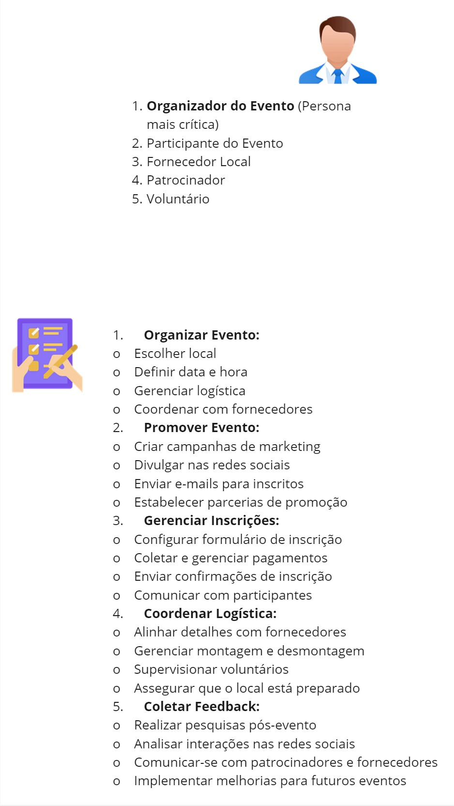

## Atividade do User Stories Mapping (USM)

O USM segue uma proposta diferente do PBB, indo para um foco mais no negócio em si, se baseia no mapeamento das Histórias de Usuário, exatamente com os Objetivos e Atividades de uma determinada Persona. Foi feito um USM para um sistema que auxilia na realização e gestão de eventos, ComunEventos. Aqui uma visão geral do mapa, mas cada uma das personas será mais detalhada para visualização.

## Reusumo do produto

## Usuários e principais atividades

#### *Miro com os diagrmas da Atividade User Stories Mapping (USM)*
##### *Personas*

<iframe width="560" height="315" src="https://miro.com/welcomeonboard/UTRRNzdJcXZ5SXpiNkFKbVR6bkYxVzA5V2dXWHVPSjk5bDYxWEpQUGVPaDlLb21nbzduSWtTTkxYZWFQTm81RXwzNDU4NzY0NTgzMzI1MTU5ODM5fDI=?share_link_id=882229210164" title="Miro" frameborder="0" allow="accelerometer; autoplay; clipboard-write; encrypted-media; gyroscope; picture-in-picture; web-share" referrerpolicy="strict-origin-when-cross-origin" allowfullscreen></iframe>

<iframe width="560" height="315" src="https://miro.com/welcomeonboard/UTRRNzdJcXZ5SXpiNkFKbVR6bkYxVzA5V2dXWHVPSjk5bDYxWEpQUGVPaDlLb21nbzduSWtTTkxYZWFQTm81RXwzNDU4NzY0NTgzMzI1MTU5ODM5fDI=?share_link_id=882229210164" title="YouTube video player" frameborder="0" allow="accelerometer; autoplay; clipboard-write; encrypted-media; gyroscope; picture-in-picture; web-share" referrerpolicy="strict-origin-when-cross-origin" allowfullscreen></iframe>

## Histórico de versão

 Data       | Versão | Descrição                        | Autor          |
| ---------- | ------ | -------------------------------- | -------------- |
| 23/08/2024 | 1.0    | Realização da atividade  |Filipe Carvalho |
| 23/08/2024 | 1.0    | Criação do Documento e Revisão da entrega | Igor Justino |