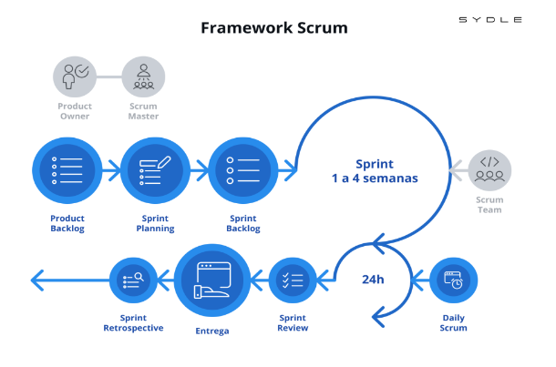

## Seleção da Metodologia

A equipe optou pela Abordagem Ágil, que é uma versão modificada do Scrum. Este método foi escolhido para garantir que os requisitos do software fossem coletados, gerenciados e monitorados de forma eficiente, o que permitiria respostas ágeis às mudanças. A flexibilidade e a capacidade de se adaptar rapidamente às mudanças são cruciais para um ambiente dinâmico, bem como para as demandas do nosso projeto que mudam com frequência. Por essas razões escolhemos este método.

O produto será projetado para atender às necessidades únicas do cliente com uma abordagem personalizada baseada em nossa versão alterada da metodologia Ágil. Nosso foco principal continua na adaptação e refinamento do produto para atender aos requisitos específicos do cliente, embora reconheçamos o potencial de nossa ferramenta para beneficiar uma gama mais ampla de profissionais da saúde. Isso está de acordo com o espírito do Scrum Ágil, na qual a entrega de valor contínuo e direcionado ao cliente é a prioridade. 

O processo será estruturado em iterações, reconhecendo que os requisitos ainda estão em desenvolvimento e serão aprimorados ao longo do projeto. A comunicação constante com o cliente é crucial para adaptarmos os requisitos de acordo com suas necessidades e garantir um resultado final satisfatório.

A característica exploratória deste projeto se traduz na participação ativa das partes interessadas em todas as etapas, o que viabiliza a evolução contínua dos requisitos.

## Planejamento de requisitos

Esta etapa é voltada para a coleta, indução de feedback, dados dos usuários, que são essenciais para a formulação dos requisitos. A etapa prossegue com a análise desses dados brutos e o ajuste dos interesses dos stakeholders, comunicando os requisitos aos envolvidos, com uma clara distinção entre requisitos funcionais e não funcionais e fornecendo níveis adequados de detalhamento.

| Atividade                | Método                    | Ferramenta               | Entrega                             |
|--------------------------|---------------------------|--------------------------|-------------------------------------|
| Descoberta e levantamento | Nominal Group Technique   | Discord e Figma          | Backlog dos Requisitos Brutos      |
| Coleta e identificação   | Reunião Síncrona          | Discord                  | Backlog dos Requisitos avaliados   |
| Especificação            | Separação por granularidade | Discord e Google Docs | Todos os requisitos representados em user stories |

## User Design

Através da apresentação dos protótipos ao cliente e da coleta de feedback, o processo de desenvolvimento se torna interativo, permitindo ajustes e melhorias contínuas até que o sistema final seja alcançado.

| Atividade       | Método                    | Ferramenta   | Entrega                            |
|-----------------|---------------------------|--------------|------------------------------------|
| Representação   | Protótipo da ferramenta  | Figma        | Simulação interativa avançada      |

## Construção

Etapa do projeto em que, após coleta e definição dos requisitos nas fases de análise, é feita a implementação e realização dos tais. Podemos definir a etapa em 4 atividades:

- Desenvolvimento/codificação: aqui, os programadores começam a codificar com base nos requisitos especificados, para implementar as funcionalidades exigidas durante a fase de análise, além dos demais processos e interfaces;

- Revisão/reavaliação de requisitos: pode-se ser necessário, durante o desenvolvimento, revisar os requisitos para verificar sua viabilidade, precisão ou para incorporar novas informações obtidas durante o desenvolvimento. Isso pode incluir ajustes nos requisitos para refletir melhor as necessidades do usuário ou as limitações técnicas descobertas durante a implementação.

- Teste de componentes: os devidos componentes criados passam por fases de testes para verificar sua devida funcionalidade, a fim de buscar erros, problemas na lógica, tempo de execução, entre outros;

- Integração: Após os componentes serem desenvolvidos e testados, eles são integrados para formar o sistema completo ou partes maiores do sistema. Também envolve testes.

| Atividade                   | Método                             | Ferramenta                              | Entrega                                |
|-----------------------------|------------------------------------|-----------------------------------------|----------------------------------------|
| Verificação e validação     | Checklist, DEEP e INVEST           | Discord e Google docs                   | Backlog na estrutura SAFe             |
| Desenvolvimento             | PairProgramming                    | IDE (VSCode, NetBeans, etc)            | Codificação do produto                |
| Revisão de requisitos       | Pair Review, Leitura Crítica, Brainstorming | Miro (registro de ideias), Discord (reuniões) | Conclusão sobre alterar ou não os requisitos |
| Teste de componentes        | Unidade, Usabilidade, Aceitação    | Jest, Puppeteer, Hotjar                | Resultados positivos dos testes       |
| Integração                  | Arquivo, por banco de dados, por API | Postman, Apache Kafka, Camel         | Funcionalidades mínimas do sistema operantes |

## Transição

Etapa do projeto que visa a entrega final do software para o cliente, podendo atravessar várias iterações, incluindo testes e ajustes baseados nos feedbacks dos usuários.

| Atividade                     | Método                          | Ferramenta     | Entrega                            |
|-------------------------------|---------------------------------|----------------|------------------------------------|
| Organização e Atualização    | Análise de valor de negócio    | Google sheets  | Backlog priorizado e Proposta de MVP |

## Histórico de versão

| Versão | Data       | Descrição                                      | Autor(es) |
| ------ | ---------- | ---------------------------------------------- | ------------------------------------------------------ |
| 1.0    | 17/04/2024 | Criação do Documento                           | [Filipe Carvalho](https://github.com/filipe-002) |

