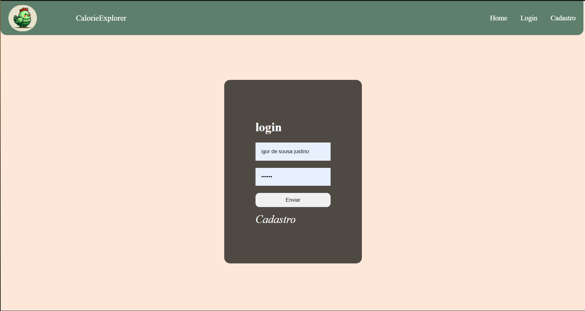
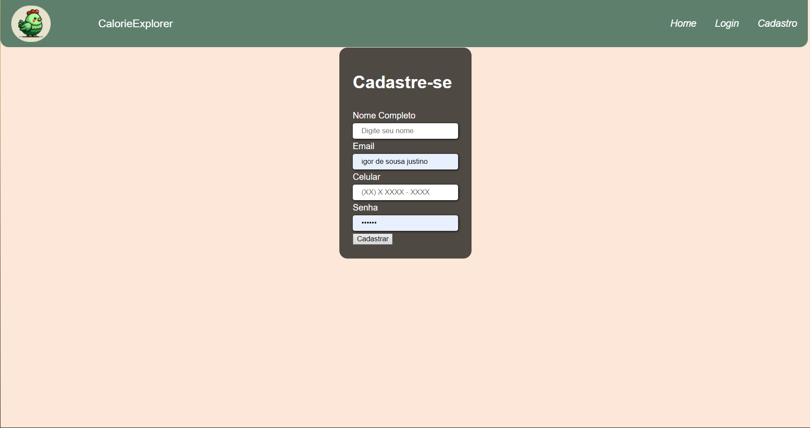
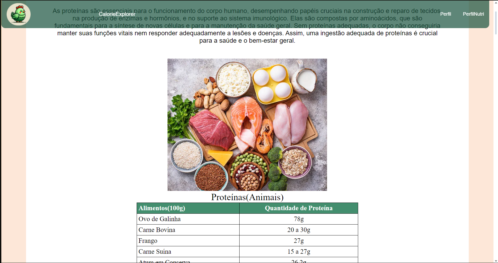
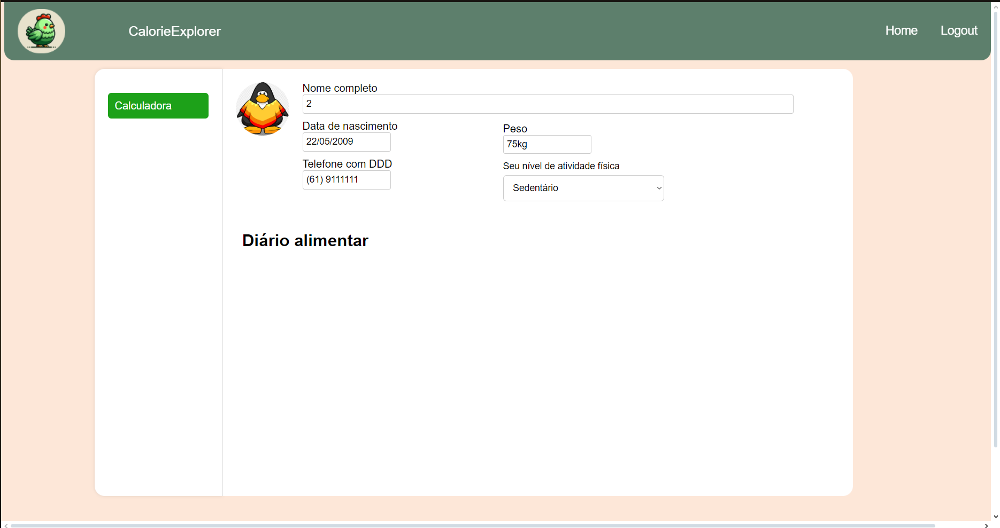
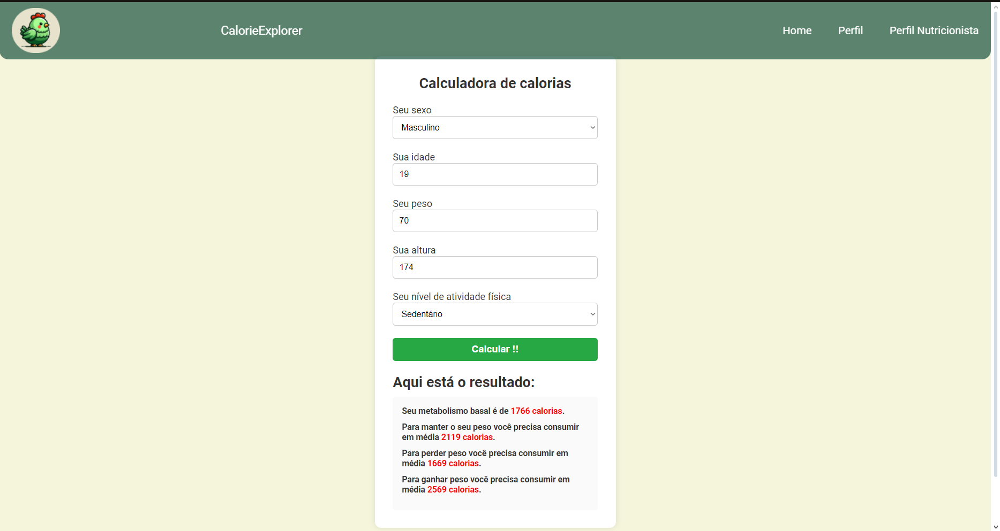
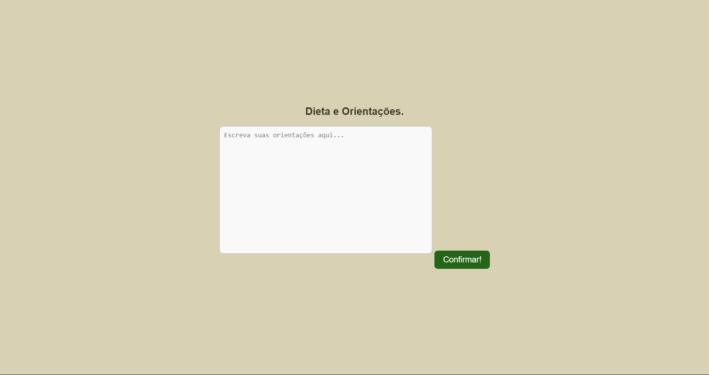
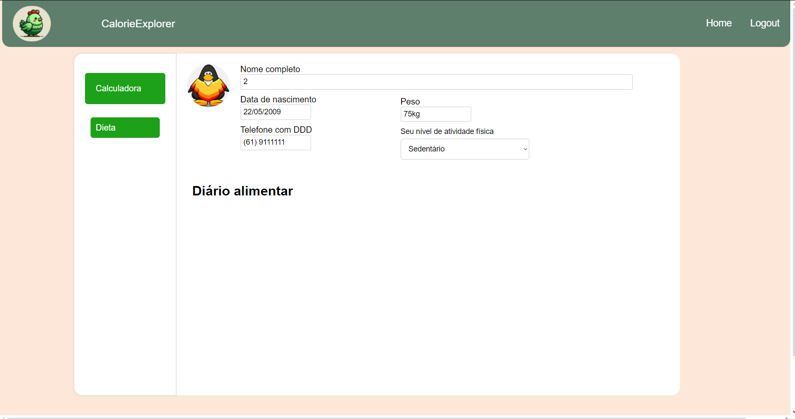

## Sprint 1
Sprint Planning
Objetivo da Sprint 01: Primeira versão da visão de produto e projeto

Tasks:
 Documentação - Declaração de Posição do Produto
  Documentação - Objetivos do Produto
 Documentação - Tecnologias a Serem Utilizadas
 Documentação - Organização do Projeto
 Documentação - Planejamento das Fases e/ou Iterações do  Projeto
 Documentação - Matriz de Comunicação
 Documentação - Gerenciamento de Riscos
 Documentação - Critérios de Replanejamento
 Documentação - Metodologia e Processo de Desenvolvimento de Sofware
 Documentação - Atividades
Documentação - Lições aprendidas da Unidade 01
Apresentação do seminário Scrum
Gravar vídeo de apresentação Unidade 01

## Sprint 2

Objetivo da Sprint 02: Elicitação de requisitos, estudo de tecnologias e protótipo de interface.

Tasks:
 Criação do protótipo de baixa fidelidade
 Visão do Produto e Projeto - Objetivos do Produto
 Visão do Produto e Projeto – Ajustes da matriz de comunicação
 Visão do Produto e Projeto – Descrição da metodologia
 Visão do Produto e Projeto – Organizar as atividades dentro do ciclo
 Visão do Produto e Projeto – Lições aprendidas
Elicitação de requisitos com o cliente (preparação sprint 03)
Estudo de tecnologias

## Sprint 3
Objetivo da Sprint 03: Contrução do Product Backlog inicial, configuração de ambiente, protótipo de alta fidelidade e estudo de tecnologias.

Tasks:
 Definição e documentação dos requisitos funcionais do Product Backlog
Definição e documentação dos requisitos não funcionais do produto
Definição e documentação do MVP1 e 
Estudo das tecnologias e configuração de ambiente

## Sprint 4
Objetivo da Sprint 04: Implementação das US01, US02, US03.

US01:

US02:

---
US03:

*Débito Tecnico, a US foi movida para a proxima Sprint.*

## Sprint 5
US03:

US04:

*Débito Tecnico, a US foi movida para a proxima Sprint.*

US05:

## Sprint 6
US04:

US06:

*Débito Tecnico, a US tem grande chances de não ser implementada por poblemas relacionados ao banco de dados.*

US07:

*Débito Tecnico, a US foi movida para a proxima Sprint.*

US08:

## Sprint 7
 US07, US09, US10, US11, US12 e US13.

US07, US09, US12 :
 

US09:

US10, US11:

Parcialmente completa, a tela e a funcionalidade foi implementada, mas por poblemas relacionados a interação entre front-end, além de outro relacionado ao banco de dados.

US11:
US12 e US13:

**A implementação dessa e junção das US03 e US07**