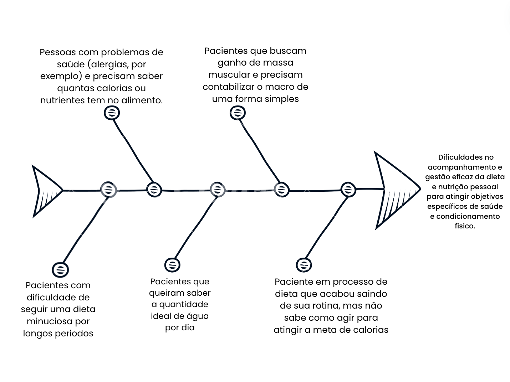

# Visão do Produto

O problema visado é que muitas pessoas costumam ingerir grandes quantidades de diversos alimentos, sem terem uma noção básica de quantas Kcal tem por 100g daquele alimento por exemplo. O site em questão envolve um alto fluxo de dados e de pessoas, para que eles possam ter uma média de quantas Kcal estão consumindo diariamente.

Visando ajudar pessoas que tem dificuldade para entrar em dieta/ter uma alimentação equilibrada, esse site mostraria pelo que ele/ela poderia substituir alguns alimentos, ou então comer o que gostaria, e compensar depois. Equilibrando entre o que a pessoa quer comer, e as necessidades que são necessárias, baseada nos seguintes fatores: idade, sexo, nível de atividade física, a condição da saúde atual e o objetivo que quer atingir. Para ajudar a encontrar a raiz do problema, foi criado um diagrama de ishikawa:

# Declaração de Posição do Produto

O produto que será desenvolvido, CalorieExplorer, é uma solução sob medida para profissionais de saúde como Mônica Rossyna, nutricionista, que buscam uma ferramenta eficaz para auxiliar seus clientes no gerenciamento da dieta. Com sua interface intuitiva e um amplo banco de dados de alimentos, o CalorieExplorer oferece a capacidade de fornecer orientações personalizadas e precisas aos seus usuários, permitindo-lhes monitorar sua ingestão calórica por refeição de forma fácil e precisa.

O CalorieExplorer se destaca pela facilidade de uso, precisão de cálculos e personalização, oferecendo um amplo banco de dados de alimentos e ferramentas de planejamento de refeições.

Nosso público-alvo inclui pessoas interessadas em saúde e condicionamento físico, como aqueles que desejam perder peso, ganhar massa muscular ou seguir uma dieta específica. Além disso, visamos profissionais de saúde, como nutricionistas e personal trainers, que buscam uma ferramenta eficaz para auxiliar seus clientes no gerenciamento da dieta.

Como benefício, buscamos facilitar escolhas alimentares conscientes, auxilia na conquista de objetivos de saúde e condicionamento físico e oferece orientações personalizadas para um gerenciamento eficaz da dieta e nutrição.

| Para              | Pacientes Nutricionais                                                                                |
| ----------------- | ----------------------------------------------------------------------------------------------------- |
| Quem              | tem dificuldades na gestão da dieta e nutrição para alcançar metas de saúde e condicionamento físico. |
| O CalorieExplorer | é voltado para a área de saúde.                                                                       |
| Que               | busca auxiliar a vida nutricional do paciente.                                                        |
| Ao contrário      | do WebDiet,                                                                                           |
| Nosso produto     | facilita a gestão de aspectos importantes da dieta pelo paciente.                                     |

# Objetivos do Produto

Objetivo Principal: O site deverá facilitar aos pacientes o acesso a informações cruciais sem depender diretamente do nutricionista. Uma vez que o cronograma de dieta tenha sido prescrito ao paciente, ele poderá modificá-la com base na quantidade de calorias necessárias em cada refeição. Além disso, o paciente terá acesso a áreas adicionais para consultar dados que foram fornecidos a ele, mas que podem ter sido esquecidos ou perdidos, o que tornará o processo mais eficiente para ambas as partes.

Objetivos Específicos:

- Fazer um site com a interface de fácil entendimento;
- Conseguir implementar cálculos que ajudaram na dieta, por exemplo quantidade de água que a pessoa precisará tomar com base em seu peso, quantidade de proteína, carboidrato, lipídios etc que deverá ser consumido diariamente.
- Conseguir também mostrar a quantidade de Kcal que cada alimento tem por alguma quantidade, por exemplo, 64 Kcal para cada 100g de tal alimento consumido.
- Com esse propósito, o projeto será um auxílio adicional ao nutricionista, possibilitando mais autonomia aos pacientes de forma segura, dinâmica e eficiente.

# Tecnologias Utilizadas

| Tecnologia     | Propósito                                                                                                     |
| -------------- | ------------------------------------------------------------------------------------------------------------- |
| Front-end      | Foi escolhido a biblioteca React.Js, que é utilizado para construção de interfaces de usuário em páginas web. |
| Back-End       | Node.js é um ambiente de execução do código JavaScript com o objetivo de criar servidores.                    |
| Banco de Dados | Foi escolhido o MySql é um sistema gerenciador de banco de dados orientado a documentos.                      |

# Ferramentas utilizadas

| Ferramentas | Propósitos                                             |
| ----------- | ------------------------------------------------------ |
| WhatsApp    | Comunicação assíncrona do time com o cliente;          |
| Discord     | Para o grupo fazer as reuniões e discutir o que fazer; |
| Teams       | Para fazer os vídeos quer foram necessários;           |
| GitHub      | Repositório e Documentação do projeto;                 |
| VsCode      | Para desenvolver o projeto;                            |
| Replit      | Para desenvolver o projeto;                            |

# Histórico de Versão

| Data       | Versão | Descrição                                  | Autor              |
| ---------- | ------ | ------------------------------------------ | ------------------ |
| 17/04/2024 | 1.0    | Criação do documento e adição dos detalhes | André Joao C Gomes |
